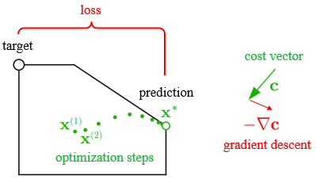
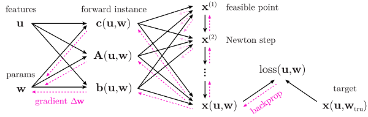

# Respository Overview  
This repository provides a Python package called `deep_inv_opt`, which is short for "deep inverse optimization." The package solves "inverse optimization" problems in a way that makes use of deep learning techniques. The associated paper, _Deep Inverse Optimization_, has been accepted to [CPAIOR 2019](http://cpaior2019.uowm.gr/) and is [available on arXiv](https://arxiv.org/abs/1812.00804). The repository also contains scripts to generate plots from the paper.

> **Paper abstract.** _Given a set of observations generated by an optimization process, the goal of inverse optimization is to determine likely parameters of that process. We cast inverse optimization as a form of deep learning. Our method, called _deep inverse optimization_, is to unroll an iterative optimization process and then use backpropagation to learn parameters that generate the observations. We demonstrate that by backpropagating through the interior point algorithm we can learn the coefficients determining the cost vector and the constraints, independently or jointly, for both non-parametric and parametric linear programs, starting from one or multiple observations. With this approach, inverse optimization can
leverage concepts and algorithms from deep learning._


# How "deep inverse optimization" works

In forward optimization, we start with an optimization model (such as a _linear program_) and aim to compute a set of decision variables **x**<sup>*</sup> that are optimal with respect to that model.
For example, given cost vector **c** and constraint coefficients **A** and **b**, we might aim to compute an **x** that is optimal with respect to the linear program
<center>
<!--
The above equation image was made by entering the latex below in https://www.codecogs.com/latex/eqneditor.php
\begin{align*}
\min_\mathbf{x} \quad& \mathbf{c}' \mathbf{x}\\
 & \mathbf{Ax} \leq \mathbf{b}
\end{align*}
--></center>

In _inverse optimization_ (IO), we do _not_ start with a fully-specified optimization model. Instead, are given a set of observed decision variables **x**<sub>target</sub> that are presumed to be optimal with respect to some _unknown_ optimization model. Our aim is to recover (to learn) that optimization model from the observed decisions. For more background on IO, see [Ahuja and Orlin (2001)](#ahuja2001) or [Chan, Lee and Terekhov, D. (2018)](#chan2018).

Our method, called _deep inverse optimization_, provides a gradient-based approach to solving inverse optimization problems. The idea is depicted below for the simplest case, where one wants to recover a cost vector **c** that is consistent with an observed target. Even if our current cost vector is wrong (leads to **x**<sup>*</sup> that is inconsistent with the target), we can backpropagate a gradient to **c** and adjust it using gradient descent.

<center></center>

The gradient is taken with respect to a 'loss' (a measure of discrepancy, such as sum of squared errors). The "optimization steps" shown above are the steps of an actual LP solver, in this case the _interior point method_. Running the interior point algorithm can be considered the _forward_ process, and computing the gradient can be considered the _backward_ process. The combined forward-backward process is depicted in Figure 2 of our paper, reproduced below. 

<center></center>

This figure depicts an LP that is parametric both in features **u** (representing time or other varying conditions of the problem) and in weights **w** (the coefficients we wish to learn so as to match observed decisions). See the paper for details.


# Installing the `deep_inv_opt` package

The package was developed using the following dependencies:
- Anaconda Python 3.6 64-bit
- PyTorch 1.0
- Numpy 1.14
- Matplotlib 2.2

Clone the repository and install the package in your environment.
For example, to install it as developer mode, run 
```
$ python setup.py develop
```

You should now be able to import ```deep_inv_opt``` from any location:
```
>>> import deep_inv_opt as io
>>> io.tensor([[0.1, 1.2]])
tensor([[ 0.1000,  1.2000]], dtype=torch.float64)
```

You can optionally run the unit tests:
```
$ nosetests
....
----------------------------------------------------------------------
Ran 4 tests in 22.156s

OK
```

# Using the `deep_inv_opt` package

See examples by browsing to the `examples/` directory in this Github repository.


# Authors
* **Yingcong Tan** - *Concordia University*
* **Andrew Delong** 
* **Daria Terekhov** - *Concordia University*


# References
1. Ahuja, R.K. and Orlin, J.B. Inverse optimization. _Operations Research_, 49(5):771–783 (2001)

2. Chan, T.C.Y., Lee, T. and Terekhov, D. Goodness of fit in inverse optimization. _Management Science_ (2018)
